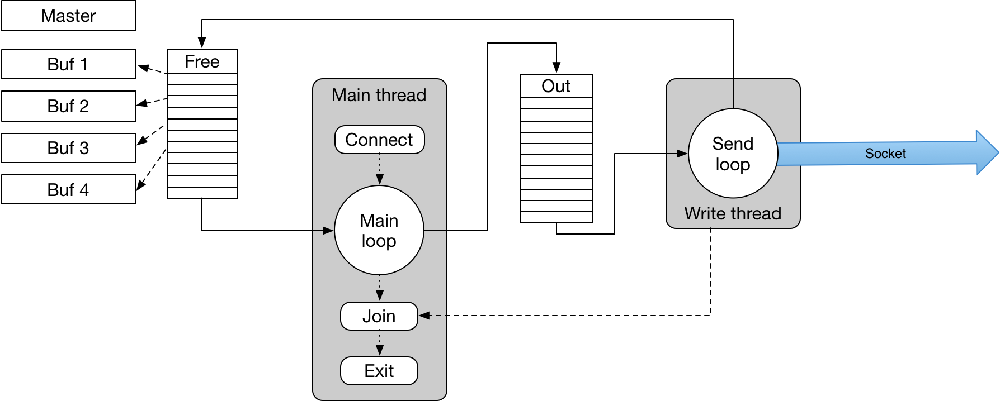

# INDRA_Stream_Test
Streaming capable hardware will generate a stream of data records from a data source. One transport mechanism is via a TCP/IP network over Ethernet. To test this capability, we require software that will receive the data on a server and route it to a client application for analysis. The test software suite consists of three parts:
•	A test sender that can send blocks in the correct format at a high enough rate to emulate the hardware.
•	A receiver router that can receive data from the emulator or from hardware data sources and publish the data so that subscribing analyzers have access.
•	An example subscriber.

The open source ZeroMQ (0MQ) library was chosen as the publish-subscribe data transport between the router and the subscriber. This choice was driven by the ease of use and availability of a mature library that is currently well maintained and should continue to be maintained and evolve in the future. The choice of pub-sub software was made first since it was felt that it could be a driving factor in the software architecture of the router. It is impractical at this time to implement in firmware an implementation of the higher-level connection types available in 0MQ. Instead we assume that the sender will send using lower level protocols. TCP was chosen over UDP since the software is simplified by relying on TCP to provide reliable delivery and flow control.


The following sections describe the three parts of the test suite in more detail.

[TOC]

## stream_test_source 

### Function

The goal of the test source is to provide a mechanism for sending data on a TCP socket with a rate and format that emulates a streaming data source. It provides the ability to test streaming data consumers under various conditions.  

### Operation

When run with no command line parameters the default action is to send a single record of length equal to the header length plus 40 bytes. This mode allows for a quick check that the reciever is functioning correctly.

#### Identifying the data source

The test source can also be used to emulate part of a larger system with multiple data sources by use of a 32-bit source ID number. By default the ID number is 0xC0DA0001. This can be changed using the -i <n> option.

```
./stream_test_source -i 0x12345678
```

#### Specifying a destination for the data

The default setting is to send to a server on port 555 on the same host. The -h <target> and -p <n> options allow the target host and port for the server to be changed.

```
./stream_test_source -h indra-s2.jlab.org -p 9998 
```

#### Specifying the data

The test data source sends fixed length buffers. The length, in bytes, can be set using the -b <n> option. This is the "payload length" and does not include headers.

```
./stream_test_source -b 4000000
```

It is possible for data dependent artifacts that would skew test results. Examples are hardware or drivers giving special treatment long sequences of the same valueor suppressing trailing zeros. To mitigate this the test client defaults to sending a buffer filled with random numbers. 

The user can use the -f <name> option to provide the path to a data file from which the buffer will be filled. 

```
./stream_test_source -f mydatafile.dat
```

Note: So that file reading does not affect data transmission testing a buffer of data is read from the file one time and then sent repeatedly. 

#### Performance testing parameters

In order to test the performance of the network link the test client has the ability to loop and send several buffers. The code times the loop and prints out block and data rates at the end of the loop.

The command line option -n <n> sets the number of buffers to send per loop. 

To improve and test accuracy the test source can repeat the test a number of times and will display accumulated statistics at the end. The number of measurements to average is specified with the -l <n> option. The following example measures the rate for sending 100 buffers, prints the rates, repeats the measurement 10 times and prints the average.

```
./stream_test_source -n 100 -l 10
```

Often it is useful to measure data rate as a function of record size. The -s option puts the data source in "scan mode". In this mode the number after the -l option is divided into the block size (number after the -b option) to calculate a size increment, M. The test data source starts with by sending n blocks of size M then repeats incrementing the block size by M until all the measurements are made. For example:

```
./stream_test_source -n 100 -l 10 -b 1000000 -s
```

This example divides 1,000,000 by 10 to get 100,000 bytes. It sends 100 buffers 100,000 bytes long then 100 buffers 200,000 bytes long and so on ending witht 100 buffers of 1,000,000 bytes.

#### Rate limiting

In this mode the user can provide a suggested data rate, in kilobytes per second, and the test client attempts to generate data at this rate. The command line option -r <n> limits the rate to the specified kilobytes per second.

```
./stream_test_source -n 100 -l 10 -b 1000000 -r 100000
```

This example will limit to 100 MB/s.

#### Debugging

For low level testing the client has a "verbose" option which turns on debug prints. This is particularly useful when sending a small number of relatively small buffers since the buffer contents are printed in hexadecimal format. With the same option used at the receiving end manual data quality checks can be made.

The command line options are summarized here:

| Argument    | Comment                                                      |
| ----------- | ------------------------------------------------------------ |
| -v          | verbose (optional)                                           |
| -h <target> | specify a host (optional, default   \"localhost\")           |
| -f <file>   | read source data from a file (optional,   default random data) |
| -p <n>      | specify a port (default 5555).                               |
| -n <n>      | number of buffers per loop (default 1).                      |
| -l <n>      | total number of cycles (default 1).                          |
| -b <n>      | n bytes per data packet (default 40).                        |
| -r <n>      | rate in kbyte/s (default, fast as possible).                 |
| -c          | compress data before send (optional, not   implemented)      |

#### Example output

In the following example the stream_test_source is used with default parameters except that debugging is turned on.

```
./stream_test_source -v -v
Debug turned on
Debug turned on
socket buffer size =100000
>>> hostname >localhost<
connected and preparing to send...
Creating buffer pool 4 buffers
Data buffers will be 88 bytes long
Filling data source buffer with random numbers
Writer for has data
Hex dump of buffer 0x7f859ec02c10
0000: 0100dac0 58000000 28000000 28000000 1920dac0 00000000 00000000 00000000
0031: 60e2075d 00000000 885dac04 00000000 a7410000 f13ad610 d9acb760 2a0cb53a
0063: 82b73144 c8da061c d88e0506 fe09e556 432ff356 4d04a477
------
Send thread exits
Done testing!
```

In the next example the code is used to send a thousand 2MByte blocks, measure the rates and repeat the test four times.

```
titus:INDRA_Stream_Test heyes$ ./stream_test_source -b 4000000 -n 1000 -l 4
send 4000000 bytes per message
loop 1000 times
Will measure rates 4 times
socket buffer size =100000
>>> hostname >localhost<
connected and preparing to send...
Creating buffer pool 4 buffers
Data buffers will be 4000048 bytes long
Filling data source buffer with random numbers
size 4000048, buffer rate 971.59 Hz, data rate 3.886387 GByte/s
size 4000048, buffer rate 1016.35 Hz, data rate 4.065461 GByte/s
size 4000048, buffer rate 964.53 Hz, data rate 3.858157 GByte/s
size 4000048, buffer rate 1033.46 Hz, data rate 4.133891 GByte/s
Send thread exits
Average rates are
----------
996.48 Hz, 3.985974 +- 0.12GByte/s
Done testing!
```


------

### Implementation details

The test code is written in C for portability and speed using standard Posix and Unix system calls. The command line arguments are decoded by the main routine which creates the socket over which the data will be sent. For maximum flexibility the target host can be specified as an IP address in dot notation or a hostname. A use of the dot notation is to force routing of the data through a specific interface. Both filling the data buffer with random numbers and reading the content from a file are time consuming tasks so a master buffer is created and filled once. The contents of the master are then copied to four buffers that are then queued in a thread safe FIFO, the "free fifo". An empty FIFO, the "output fifo", is created along with a thread to handle writing on the socket. The main thread then enters a loop. Each time around it takes a buffer off the "free fifo", updates the record_counter field in the header, and puts the buffer on the "output fifo". The number of loops is either 1 or the product of the -n and -l option values. Meanwhile, the write thread waits on the "output fifo", dequeues buffers which are written on the socket and returned the "free fifo". 

 

This sounds overly complicated but is done this way to provide "hooks" for future development. For example, a future implementation could use several write threads in parallel to improve throughput. Another partially implemented option is to add a compression stage into the pipeline.  A buffer from the "free fifo" would be passed via fifos to one of several compression threads which would compress the data part of buffers before they are put into the "output fifo". Once the compressed data has gone over the network the data in the buffer can be restored via a quick copy from the master copy and put back in the "free fifo".

The main thread loop exits when the requested number of records have been queued. Since the writing is done in a separate thread the main routine must wait for all of the writing thread to finish before it can exit.

### Protocol

By default, the client attempts to connect to a server listening on TCP port 5555 and running on the same host. Command line options to change these values will be described later. If the server accepts connection, then the client first sends an eight byte data preamble on the newly connected socked. These bytes encode two uint32_t values:

| Type         | Name         | Value                               |
| ------------ | ------------ | ----------------------------------- |
| **uint32_t** | Magic Number | 0xC0DA2019                          |
| **uint32_t** | Source ID    | Numberic value (default 0xC0DA0001) |

The value named "Magic Number" is a unique code that is unlikely to be the first four bytes sent over a connection if the sender is not this software. The receiver checks this code and immediately closes the connection if the test fails. The value names "source ID" is a 32-bit number that uniquely identifies the source of the data. 

> Note: In a large system with many data source the sourece ID need not be unique system wide. It is only required to be unique for all data sources sending to the same TCP port.

If the preamble is accepted by the server the client can then send one or more data records to the server. Each data record begins with a header followed by the data payload. The header format is as follows :

| **Type**     | **Name**          | **Comment**                                                  |
| ------------ | ----------------- | ------------------------------------------------------------ |
| **uint32_t** | source_id         | 32-bit identifier for this data source. The default   value is 0xC0DA0001 but can   be overridden from the command line. It   appears first in the record since this simplifies code in the router (see   later section). |
| **uint32_t** | magic             | 32-bit marker with the hexadecimal value 0xC0DA2019. The use of a   marker word protects against the case where there happens to be some random   software already listening on the chosen TCP port. It also protects the   server since it unlikely that some random software accidentally connecting   would send that particular byte sequence. |
| **uint32_t** | total_length      | The length of the entire record, including the   header, in units of bytes. This limits the maximum record length to the   maximum value of uint32_t. *total_length*   is always divisible by 4 and must be rounded up if the sum of data and header   lengths is aligned. |
| **uint32_t** | payload_length    | The length of the data that follows the header if the payload is   uncompressed. In this case the total_length = header length + payload_length. |
| **uint32_t** | compressed_length | The length of the data that follows the header if   the payload is compressed. In this case total_length = header_length +   compressed_length. If *compressed_length*   is zero the payload is assumed to be uncompressed. *payload_length* must still be set so that the receiver can   allocate space for the payload after uncompression. |
| **uint32_t** | format_version    | An integer value that   identifies the header format.        |
| **uint64_t** | record_counter    | A count of the number of records sent since the   connection opened. It must increment by 1 for each record received and   protects against unintended retransmission or dropping of a record. |
| **uint64_t** | timestamp_sec     | 64-bit number of seconds in the 128-bit timestamp.           |
| **uint64_t** | timestamp_nsec    | 64-bit number of nanoseconds in the 128-bit   timestamp.     |

The following diagram shows the relationship between the three length fields. 


The Total Length is the length in bytes of the entire record, including header at the start and any padding at the end. The ability to pad allows the  possibility that the next record can begin aligned to a word boundary to aid mapping of the header onto a C/C++ structure. It also allows for implementations where the record length is fixed irrespective of how much of the space is used to store data.

The pair of length, Payload Length and Compressed Length, allow for future implementations that compress the large data payload before it is sent over the network.

Independent of whether compression is used or not the Payload Length always represents the length of the data payload in uncompressed form. If the data is not compressed then this is identical to the Compressed Length field. If the payload has been compressed the Compressed Length field holds the length of the space in the record occupied by the compressed payload. In that case the Payload Length is has the same definition as earlier, the space required to hold the payload after decompression.

 ## stream_router 

 ### Function

The goal of the test router is to provide a mechanism for receiving data on a TCP socket and publishing it so that one or more subscribers have access to the data. It provides the ability to test streaming data producers under various conditions giving the ability to measure data and block reception rates and display recieved data block contents.

 ### Operation

#### Server port selection

The Stream Router listens for incoming TCP connections on a port specified using the -p option. 

```
./stream_router -p 5555
```

In this example the router listens on port 5555

#### Debugging

The -v option sets the debug verbosity, each instance of -d increments the level by one.

```
./stream_router -v -p 5555
```

In this example the router listens on port 5555 and prints diagnostics in the thread that reads data from the socket. Adding a second -v turns on printing of the entire incoming block in hex format.

#### Statistics

The -s option turns on printing of buffer rate and data rate at a fixed 10 second interval.

#### ZeroMQ options

The stream_router is so called because it has the optional ability to forward incoming data blocks to one or more destination processes. One option is to publish using  ZeroMQ publish subscribe sockets.

The -z option enables publishing via ZeroMQ.

The -u option allows the user to specifu a ZeroMQ URL that subscribers can subscribe to, the default is "tcp://*:5556"

For example :

```
./stream_router -v -p 5555 -z -u tcp://*:9876
```

Will publish the data to any subscribers using TCP to port 9876.


Option summary : 

| Argument  | Comment                           |
| --------- | --------------------------------- |
| -v        | Verbose logging                   |
| -p <port> | Listen on specified port          |
| -s        | Print statistics every 10 seconds |
| -z        | Turn on ZeroMQ publishing         |
| -u <url>  | Specify the URL for publishing    |

#### Example output 

```


$ ./stream_router -v -v
./stream_router starts
Initializing -------
	Executing with command line options
	TCP stream input port 5555
	NOT Publishing using ZMQ

## 	NOT printing stats every 10 seconds.

​```
listening on port 5555 for incoming stream connections
​```

Output thread starts -------
We got a connection from 127.0.0.1
fire up a thread to handle it,
Worker thread C0DA0001 starts -------
Read the ID - 4 bytes
 	ID = C0DA0001
read overall length
	length = 88
read 88 bytes of data
Hex dump of buffer 0x7fa239d00420
0000: 0100dac0 58000000 28000000 28000000 1920dac0 00000000 00000000 00000000
0031: c1d7075d 00000000 08fdf031 00000000 a7410000 f13ad610 d9acb760 2a0cb53a
0063: 82b73144 c8da061c d88e0506 fe09e556 432ff356 4d04a477

read ID from block header C0DA0001
Add buffer to output stream
Read the ID - 4 bytes
Worker thread C0DA0001 ends -------
```

In this example the sender has ID C0DA0001 and sent exactly one data block 88 bytes long. The thread receiving the stream via TCP terminates when the connection closes. The sender sends it's ID as the first four bytes of every block so the termination should always occur while the receiving thread is waitinf for the four byte ID.


## stream_test_subscriber 

### Function

The stream_test_subscriber is an example of a subscriber to the data published by stream_router. It provides some basic functionality but is intended to be used as the basis for developer's code.

### Operation

#### Debugging

The -v option turns the debug output on which causes a dump of the entire block in hexadecimal format.

```
./stream_test_subscriber -v
```

#### ZeroMQ URL

The -u option sets the ZeroMQ URL on which to listen for incoming data. 

```
./stream_test_subscriber -u tcp://127.0.0.1:9876
```

The default is tcp://127.0.0.1:5556 

#### Subscribed source ID

This argument is ten characters long and encodes a four byte source ID in hexadecimal.

./stream_test_subscriber -u tcp://127.0.0.1:9876 0xC0DA0001

The defalt is 0xC0DA0001.

#### Example output

In this example we use the default URL, accept data only from the data source with ID 0xC0DA0001, and have debug on so we print the contents of the block. (note that this is the same as the previous example except for differences in the timestamp).

```
./stream_test_subscriber -v 0xC0DA0001
Debug level 1
Subscribe to URL: tcp://127.0.0.1:5556
Filter = c0da0001
Subscribing to data source C0DA0001
id C0DA0001 == C0DA0001 length 88, counter 0
Hex dump of buffer 0x7ff1c700260a
0000: 0100dac0 58000000 28000000 28000000 1920dac0 00000000 00000000 00000000
0031: cddb075d 00000000 70f96f03 00000000 a7410000 f13ad610 d9acb760 2a0cb53a
0063: 82b73144 c8da061c d88e0506 fe09e556 432ff356 4d04a477
------
```

#### Notes for developers

When using the ZeroMQ pub-sub socket pair the subscriber subscribes to the URL specified and recieves ALL data published. The subscriber filters incoming data, looking for a match between a predefined N-byte pattern and the first N bytes of the incoming data. In the example code there is the following line  : 

```
ret = zmq_setsockopt(socket, ZMQ_SUBSCRIBE, &source_id, 4);
```

This specifies that ZMQ compare the first four bytes of the data record with  the uint32_t value of source_id. This is set to 0xC0DA0001 and overriden by the first command line argument that is not one of the options.

```
	uint32_t source_id = strtol(argv[optind], NULL, 0);
```

The format of the data record can be found in stream_tools.h it is :

```
typedef struct stream_buffer {
    uint32_t source_id;
    uint32_t total_length;
    uint32_t payload_length;
    uint32_t compressed_length;
    uint32_t magic;
    uint32_t format_version;
    uint64_t record_counter;
    struct timespec timestamp;
    uint32_t payload[];

} stream_buffer_t;

```

As you can see, source_id is positioned as the first four bytes deliberately so that it can be used as the filter.

##### Stream routing options

The four byte source ID at the start of each record allows for a lot of possible data sources to be routed via one router. It is likely that the user would like many channels sent to the same subscriber rather than one subscriber per channel. One thing that could be played with is how incoming records are matched. For example, by matching only the first byte of the data record (due to byte ordering this is the right most pair of digits in the source ID) and defining this to mean "detector". Then the rest of the ID could be channel within the detector. For large systems one router may not be able to manage the data flow and one could imagine several routers running in parallel. In this case each detector could stream data to it's own router using different TCP port/host pairs.